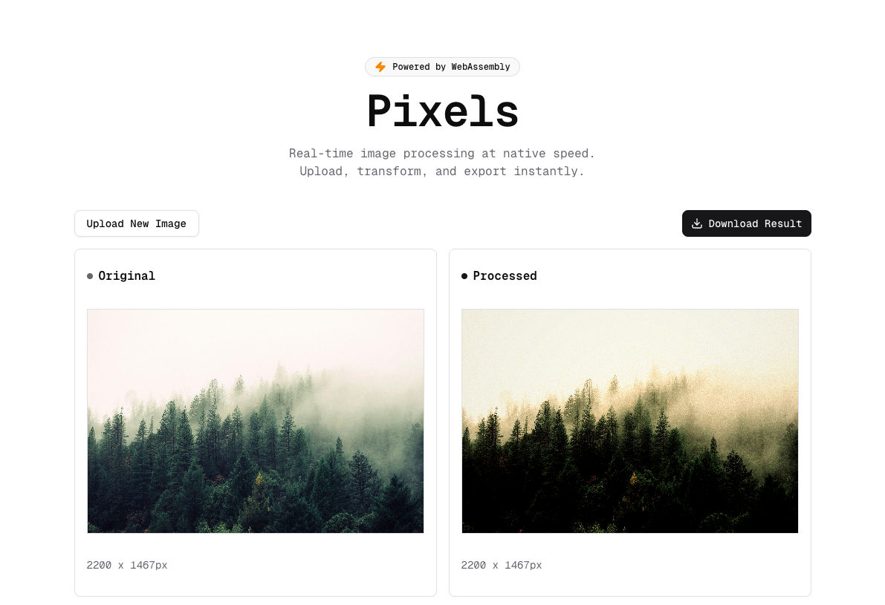

# Pixels ⚡️

**Pixels** is a blazing-fast, real-time image processing application powered by **WebAssembly (Rust)** and **Next.js**. It brings native-performance image editing capabilities directly to the browser, allowing for complex pixel manipulations without server-side processing.



## ✨ Features

- **🚀 WebAssembly Core**: Heavy image processing tasks are handled by Rust-compiled WASM for near-native performance.
- **🎨 Real-time Filters**:
  - **Classics**: Grayscale, Invert, Sepia.
  - **Aesthetics**: Lo-Fi (w/ Grain), Vintage, Cyberpunk.
- **🎛️ Granular Adjustments**:
  - Precise **Brightness** & **Contrast** control.
  - **Vignette** effect calculation.
  - **Scaling** (Nearest Neighbor) from 10% to 200%.
- **📐 Transformations**:
  - **Crop** presets (Original, Square, 4:3, 16:9).
  - **Flip** Horizontal & Vertical.
- **⚡️ Reactive UI**:
  - Smooth, non-blocking sliders using React's `useDeferredValue`.
  - Modern, accessible UI components built with **Shadcn UI**.

## 🛠️ Technology Stack

- **Frontend Framework**: [Next.js 15](https://nextjs.org/) (App Directory)
- **Language**: TypeScript & Rust
- **Styling**: Tailwind CSS & Shadcn UI
- **WASM Tooling**: `wasm-pack` & `wasm-bindgen`
- **Icons**: Lucide React

## 🚀 Getting Started

### Prerequisites

- [Node.js](https://nodejs.org/) (v18+ recommended)
- [Rust & Cargo](https://rustup.rs/) (for compiling the WASM core)
- `wasm-pack`: Install via `cargo install wasm-pack`

### Installation

1.  **Clone the repository:**

    ```bash
    git clone https://github.com/asadsid004/pixels.git
    cd pixels
    ```

2.  **Install dependencies:**

    ```bash
    npm install
    # or
    bun install
    ```

3.  **Compile the WebAssembly core:**
    The Rust code lives in `wasm-core/`. You need to build it into a package that the browser can use.

    ```bash
    cd wasm-core
    wasm-pack build --target web --out-dir ../wasm
    cd ..
    ```

4.  **Run the development server:**

    ```bash
    npm run dev
    # or
    bun dev
    ```

5.  Open [http://localhost:3000](http://localhost:3000) to see the app in action!

## 📂 Project Structure

```
pixels/
├── src/
│   ├── app/              # Next.js App Router pages
│   ├── components/       # React components (FilterControls, ImageUpload, etc.)
│   └── lib/              # Utilities
├── wasm-core/            # 🦀 Rust Source Code
│   ├── src/lib.rs        # Main WASM logic (Filters, Transformations)
│   └── Cargo.toml        # Rust dependencies
├── wasm/                 # 📦 Generated WASM binary & JS glue code
└── public/               # Static assets
```

## 🧩 Adding New Filters

Adding a new filter is easy!

1.  **Rust**: Add a public function in `wasm-core/src/lib.rs` marked with `#[wasm_bindgen]`.
    ```rust
    #[wasm_bindgen]
    pub fn new_cool_filter(pixels: &mut [u8]) {
        // manipulate pixels...
    }
    ```
2.  **Build**: Run `wasm-pack build` to update the WASM binary.
3.  **UI**: Update `src/components/filter-controls.tsx` to add a new button.
4.  **Logic**: specific the case in the switch statement in `src/app/page.tsx`.
